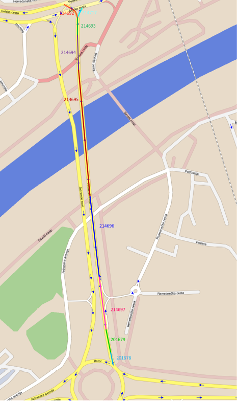

# Vehicle Trajectory based on GPS data

Simple ASP.NET web API template of the recorded vehicles trajectory that crossed the [Jadranski Most](https://www.google.com/maps/@45.7827184,15.9530504,18z?entry=ttu).

# GPS Data Description
Inside gps_data.txt are vehicle trajectory data based on GPS tracking in the area of Jadranski most. 
The range of the area that is used for tracking is shown in the [figure1](#picture1), while the coordinates is shown in the [table](#table).

Coordinates | Longitude | Latitude 
---         | ---       | --- 
1           | 15.950211 | 45.775915
2           | 15.956874 | 45.776898
3           | 15.9546261| 45.788320
4           | 15.948400 | 45.786958

Each record of a new vehicle route in the file begins and ends with the sign **NEW _ ROUTE**, followed by all recorded vehicle records of the route, which are located inside the range.
The records are time-sorted, and the attributes of each record are separated by the sign "**_;_**".

## A Description Vehicle Attributes

An example of one vehicle record from gps_data: 
-214696;1350032645;15.952734500169754;45.780397919459887;15.952774733304977;45.780401660660324;110;348;50;348;50

Attribute | Example            | Description
---       | ---                | --- 
LINK      | -214696            | Id of associated link on the digital map 
UTC       | 1350032645         | UTC time in seconds (from 1.1.1970)
MATCH_X   | 15.952734500169754 | Associated longitude [&ordm;]
MATCH_Y   | 45.780397919459887 | Associated latitude [&ordm;]
ORG_X     | 15.952774733304977 | Original longitude [&ordm;]
ORG_Y     | 45.780401660660324 | Original latitude [&ordm;]
MATCH_D   | 110                | Associated travel distance from previously recorded points [m]
MATCH_H   | 348                | Associated geographical direction of movement in relation to the north [&ordm;]
MATCH_S   | 50                 | Associated speed of movement [km/h]
ORG_H     | 348                | Original geographical direction of movement in relation to the north [&ordm;] (360&ordm; = 0&ordm;)
ORG_S     | 50                 | Original speed of movement [km/h]

The vehicle trajectory data consists of nine links. The links are shown in the [figure2](#picture2). The Link values represent the route of traffic. If the link contains a positive value, 
then the direction of the movement is South-North, while a negative value indicates the opposite direction.

